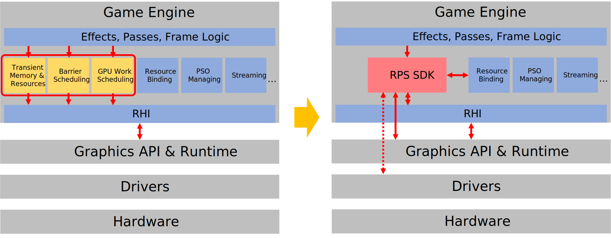
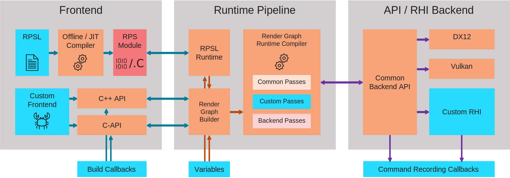

# AMD Render Pipeline Shaders (RPS) SDK

Copyright (c) 2024 Advanced Micro Devices, Inc.

The AMD Render Pipeline Shaders (RPS) SDK is released under the MIT LICENSE. Please see file
[LICENSE.txt](LICENSE.txt) for full license details.

The AMD Render Pipeline Shaders (RPS) SDK Open Beta was previously released under the 
AMD INTERNAL EVALUATION LICENSE.

## Introduction

The AMD Render Pipeline Shaders (RPS) SDK is a comprehensive and extensible Render Graph framework.

Since the debut of explicit graphics APIs (Direct3D 12 and Vulkan®), Render Graphs (or Frame Graphs) have been proposed
as an elegant and efficient solution to various problems such as generating resource barriers, managing transient memory
and scheduling GPU workload. In practice, it is non-trivial to implement a render graph system from scratch, and it
requires effort to keep it optimal according to hardware, API and content changes. Porting effects and techniques
between different render graph systems may also consume extra engineering time.



The RPS SDK intends to make Render Graphs more easily accessible and to provide a generally optimal barrier generator
and (aliasing) memory scheduler. RPS also tries to simplify Render Graph construction by extending HLSL with attributes
and intrinsics to create a domain specific language for render graph programming. This enables opt-in applications to
program Render Graphs implicitly via a high-level, declarative programming model, allowing users to focus on the render
pipeline logic rather than node configuration details. We call the extended language "Render Pipeline Shader Language",
or RPSL.

The SDK has a compiler-like architecture. It includes a frontend used to specify resources and a node sequence, a
runtime compiler which compiles the linear node sequence into a graph and schedules it, and a runtime backend that
converts the scheduled render graph into graphics API commands.



The RPS SDK is built with controllability and extensibility in mind. The HLSL language extension and API provide a rich
set of controls for customizing its behavior. Both the frontend, the runtime render graph compiler, and the backend can
be extended and customized.

## Content Structure

Notable directories and files of the SDK:

- [./include](./include/): Main public API headers.
- [./src](./src): Main implementation sources and C++ class definitions.
- [./tools/rps_hlslc](./tools/rps_hlslc/): The RPSL compiler toolchain ([Windows x64](./tools/rps_hlslc/win-64), [Linux x64](./tools/rps_hlslc/linux-x64)).
- [./tools/rps_hlslc/rpsl/rpsl.h](./tools/rps_hlslc/rpsl/rpsl.h): The RPSL language documentation embedded in a header file.
- [./tools/rps_visualizer](./tools/rps_visualizer): A library to visualize RPS render graph resources and memory layout. Please refer to [README.md](./tools/rps_visualizer/README.md) for more details.
- [./tools/rps_explorer](./tools/rps_explorer): A tool to load and test RPSL files.
- [./tests/console](./tests/console) and [./tests/gui](./tests/gui): Test cases. Currently also serve as samples.

## Build

### Prerequisites

- OS: Windows 10 21H2 or later.
- Compiler: A C++11 compliant compiler. Tested compilers include Visual C++ toolset v141 or later (VS2017+) and Clang 15.0.1.
- CMake: CMake 3.12.1 or later.
- Vulkan SDK 1.2.162.1 or later (If the Vulkan backend and its dependents are desired).

### Submodule dependencies

The SDK has [catch2](https://github.com/catchorg/Catch2.git) and [imgui](https://github.com/ocornut/imgui.git) as
external git submodule dependencies. If you didn't initially clone with `--recursive` or another method that fetches the
submodule dependencies automatically, please `git submodule init` and `git submodule update` inside the SDK clone
directory to fetch them before attempting to build.

### Build Steps

The SDK uses CMake. There are a few ways to start:

- Using default build batch file [./build.bat](./build.bat).
- Manually config using CMake:

    ```cmake
    cmake -S ./ -B ./build -A x64
    cmake --build ./build --config RelWithDebInfo
    ```

### Running Tests & RPSL Explorer

After a successful build:

- By default (or when CMake option RpsBuildTests is ON), all tests can be executed by running ctest from the build folder:

    ```bash
    cd build
    ctest -C RelWithDebInfo
    ```

- By default, the RPSL Explorer binaries can be located at `./build/tools/rpsl_explorer/<config_name>/`. Run `rpsl_explorer.exe` and open an RPSL file to start hacking!

## Getting Started

If you are new to RPS, we recommend reading through our tutorial which you can find at [./docs/tutorial](./docs/tutorial) in this repository and at [https://gpuopen.com/learn/rps-tutorial](https://gpuopen.com/learn/rps-tutorial) on GPUOpen.

After this, you should be well equipped to browse the [test samples](./tests) and let RPS drive the frame graph logic of your own 3D application.

## Documentation

The main sources of documentation for the RPS public APIs are inlined Doxygen-style comments, which can be built into
HTML documents if Doxygen is installed (tested with Doxygen version 1.9.2):

```bash
doxygen
```

## Getting Help

If you are facing any problems that you cannot solve by checking out the documentation or the samples, do not worry. You can contact us by [raising GitHub issues](https://github.com/GPUOpen-LibrariesAndSDKs/RenderPipelineShaders/issues), [@GPUOpen](https://twitter.com/GPUOpen) on Twitter, [@GPUOpen@mastodon.gamedev.place](@GPUOpen@mastodon.gamedev.place) on Mastodon and by using [this invitation link](https://discord.gg/sZhDJ2rDa9), you can join our Discord server and chat with the RPS team directly. 

## Integration

If the parent project uses CMake, RPS can be added as a subdirectory, e.g.:

```cmake
set(RpsRootSolutionFolder "rps")
add_subdirectory(libs/AMD/rps)
```

RPS can also be integrated as pre-built static libraries, or you may include the RPS sources directly.

The main header to include is [./include/rps/rps.h](./include/rps/rps.h). A few macros (`RPS_D3D12_RUNTIME`,
`RPS_VK_RUNTIME`, `RPS_D3D11_RUNTIME`) can be used to selectively enable default runtime backends.

RPSL files can be compiled into C source code with the provided RPS-HLSLC tool chain at development time. The generated
.C file can be integrated into the engine or application sources. Typical usage:

```bash
rps-hlslc.exe <rpsl_file_name> [-od <outout_directory>] [-m <override_module_name>] ...
```

Please see [./tools/rps_hlslc/README.md](./tools/rps_hlslc/README.md) for usage details.

Currently, the RPS SDK is released under the AMD Internal Evaluation License. We welcome everyone to try it out and
appreciate any feedback! If you are interested in using it in a future engine or title product, please contact an AMD
Alliance Manager or Developer Technology engineer.

## Third-Party Software

- [Catch2](https://github.com/catchorg/Catch2)
- [Dear ImGui](https://github.com/ocornut/imgui)
- [Microsoft DirectX Shader Compiler](https://github.com/microsoft/DirectXShaderCompiler)
- [LLVM](https://llvm.org/)
- [LLVM-CBE (C Backend)](https://github.com/JuliaHubOSS/llvm-cbe)

## Attribution

- AMD, the AMD Arrow logo, Radeon, Crossfire, and combinations thereof are either registered trademarks or trademarks of Advanced Micro Devices, Inc. in the United States and/or other countries.
- Microsoft, DirectX, Visual Studio, and Windows are either registered trademarks or trademarks of Microsoft Corporation in the United States and/or other countries.
